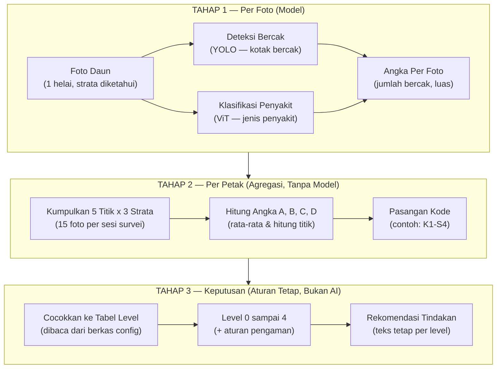

# Spesifikasi Skema Sampling dan Rule Engine

## Penentuan Tingkat Keparahan Penyakit Bercak Daun Padi

> **Dokumen acuan pengembangan aplikasi — untuk tim developer**  
> **Penelitian:** Multi-Task Deep Learning for Rice Leaf Disease Management: Sistem Terintegrasi Deteksi, Diagnosis dan Rekomendasi Pengendalian Presisi

| Atribut | Keterangan |
| :--- | :--- |
| **Skema Pendanaan** | Hibah BIMA Tahun 2026 |
| **Institusi** | Jurusan Teknologi Informasi dan Komputer, Politeknik Negeri Subang |
| **Ketua Peneliti** | Willy Muhammad Fauzi, S.T., M.Kom. |
| **Versi Ambang** | 1.0 |
| **Status** | Sebagian aturan masih menunggu penegasan ahli (lihat Bab 8) |

---

## 1. Ringkasan

Dokumen ini menjelaskan bagaimana aplikasi mengubah hasil deteksi model menjadi satu keputusan tingkat keparahan beserta rekomendasi tindakan. Sasaran pembacanya adalah tim developer yang akan mengimplementasikan bagian sesudah model, yaitu pengumpulan data survei, agregasi, dan mesin aturan.

Satu hal yang perlu dipahami sejak awal: **model hanya bertugas menghitung, bukan memutuskan.** Keluaran model berupa jumlah bercak dan jenis penyakit. Penentuan level keparahan dilakukan oleh mesin aturan tetap berupa lima langkah tabel yang berasal dari tabel ambang ekonomi yang disusun ahli pertanian. Pemisahan ini disengaja, agar setiap keputusan aplikasi dapat ditelusuri dan dipertanggungjawabkan.



*Gambar 1. Tiga tahap pemrosesan. Tahap 1 melibatkan model, tahap 2 dan 3 murni perhitungan dan aturan.*

---

## 2. Skema Pengambilan Contoh

Satu sesi survei dilakukan pada satu petak sawah dengan asumsi bentuk mendekati persegi. Diambil lima titik contoh mengikuti **pola X**, yaitu empat sudut petak dan satu titik di tengah. Setiap titik diwakili oleh **satu rumpun tanaman**.

Pada setiap rumpun diambil tiga foto sesuai posisi daun, sehingga satu sesi survei menghasilkan **lima belas foto**. Posisi daun tidak dapat ditentukan oleh model dari foto jarak dekat, sehingga pengguna wajib memilih posisi daun sebelum kamera diaktifkan.

```text
+-------------------------------------------------------------+
|                     PEMATANG (BATAS PETAK)                  |
|                                                             |
|   [T1] Kiri Atas                             [T2] Kanan Atas |
|         \                                   /               |
|          \                                 /                |
|           \                               /                 |
|            \                             /                  |
|                          [T5]                               |
|                         Tengah                              |
|            /                             \                  |
|           /                               \                 |
|          /                                 \                |
|         /                                   \               |
|   [T3] Kiri Bawah                           [T4] Kanan Bawah |
|                                                             |
+-------------------------------------------------------------+

Pembagian Strata Daun per Rumpun (3 Foto per Titik):
- Daun Atas              -> Na
- Daun Tengah (posisi 4-7) -> Nt
- Daun Bawah  (posisi 1-3) -> Nb
```

*Gambar 2. Denah lima titik contoh dan pembagian strata daun pada setiap rumpun.*

> **Catatan Lapangan:** Titik contoh tidak diambil tepat di pojok petak, karena tepi petak memiliki kondisi mikro yang berbeda dari bagian dalam. Untuk petak yang bentuknya tidak beraturan, panduan praktis yang dapat dipakai adalah membayangkan dua garis diagonal petak, lalu mengambil empat ujung dan titik perpotongannya.

---

## 3. Struktur Data

Data yang disimpan adalah data per titik, bukan hanya hasil agregatnya. Nilai per titik diperlukan untuk memunculkan peringatan titik dengan serangan lebih tinggi, dan juga menjadi data mentah penelitian.

### 3.1 Masukan untuk Mesin Aturan

```json
{
  "id_sesi": "...",
  "id_petak": "...",
  "waktu": "...",
  "titik": [
    { "kode": "T1", "posisi": "kiri_atas", "Nb": 18, "Nt": 12, "Na": 1 },
    { "kode": "T2", "posisi": "kanan_atas", "Nb": 22, "Nt": 14, "Na": 0 },
    { "kode": "T3", "posisi": "kiri_bawah", "Nb": 19, "Nt": 11, "Na": 1 },
    { "kode": "T4", "posisi": "kanan_bawah", "Nb": 21, "Nt": 13, "Na": 0 },
    { "kode": "T5", "posisi": "tengah", "Nb": 20, "Nt": 12, "Na": 0 }
  ],
  "intensitas": 1.8,
  "penyakit": "brown_spot"
}
```

### 3.2 Cara Memperoleh Nb, Nt, dan Na

Nilai `Nb`, `Nt`, dan `Na` pada satu titik adalah jumlah kotak deteksi yang lolos ambang keyakinan pada foto strata yang bersangkutan. Bila satu strata diwakili lebih dari satu foto, jumlahnya ditambahkan.

### 3.3 Cara Memperoleh Intensitas

$$\text{intensitas} = \frac{0{,}785 \times \text{jumlah luas seluruh kotak bercak}}{\text{luas helai daun}} \times 100\%$$

* **Angka 0,785** adalah koreksi bentuk. Bercak berbentuk mendekati elips sedangkan kotak deteksi berbentuk persegi, sehingga luas kotak selalu lebih besar dari luas bercak sebenarnya. Bila di kemudian hari digunakan segmentasi dan bukan kotak deteksi, nilai koreksi diubah menjadi `1` melalui berkas konfigurasi.
* **Bila luas daun belum dapat dihitung:** Nilai intensitas dikirim sebagai `null`. Mesin aturan tetap berjalan, hanya aturan pengaman pada Langkah 4/5 yang dilewati. Aplikasi tidak boleh menebak nilai intensitas.

---

## 4. Dua Pertanyaan yang Dijawab Sistem

Untuk memutuskan tingkat keparahan, sistem hanya perlu menjawab dua pertanyaan. Seluruh aturan pada bab berikutnya adalah cara menjawab kedua pertanyaan ini secara konsisten.

| No | Pertanyaan | Cara Menjawab |
| :-: | :--- | :--- |
| **1** | Bercaknya banyak atau tidak di daun bawah? | **Soal jumlah**, sehingga dijawab dengan rata-rata dari lima titik. |
| **2** | Penyakitnya sudah naik sampai posisi daun mana? | **Soal ada atau tidak ada**, sehingga dijawab dengan menghitung berapa titik yang terdampak, bukan dirata-rata. |

> **Mengapa pertanyaan kedua tidak dirata-ratakan?**  
> Misalkan jumlah bercak daun atas pada lima titik adalah 0, 0, 0, 0, dan 2. Rata-ratanya 0,4 sehingga bila dibandingkan dengan syarat minimal 1 bercak, sistem menyimpulkan daun atas masih bersih. Kenyataannya sudah ada satu titik yang terdampak, pada bagian tanaman yang paling menentukan hasil panen. Karena itu pertanyaan kedua dijawab dengan cara menghitung jumlah titik, sehingga fakta tersebut tidak hilang.

---

## 5. Aturan Penentuan Level

Aturan dijalankan berurutan dalam lima langkah. Setiap langkah dapat dibaca sebagai satu tabel.

```text
[LANGKAH 1 & 2: Kepadatan]           [LANGKAH 1 & 3: Sebaran]
         Hitung A                          Hitung B, C, D
(Rata-rata bercak daun bawah)       (Jumlah titik penuhi syarat)
              |                                  |
          A >= 20?                               |---> B >= 2?  --Ya--> S4
          /      \                               |---> C >= 2?  --Ya--> S3
       (Ya)      (Tidak)                         |---> D >= 2?  --Ya--> S2
        |           |                            |---> Ada bercak? ---> S1
       K1          K0                            +---> Bebas bercak -> S0
        \           /                                    /
         \         /                                    /
    [LANGKAH 4: Cocokkan Matriks Level (K x S)] <------+
                         |
                   (Level Dasar)
                         |
    [LANGKAH 5: Koreksi Intensitas & Peringatan Titik Parah]
```

*Gambar 3. Ringkasan lima langkah penentuan level.*

### Langkah 1 — Hitung Empat Angka dari Data Lima Titik

| Angka | Cara Menghitung | Menghitung Apa |
| :---: | :--- | :--- |
| **A** | Rata-rata jumlah bercak daun bawah dari lima titik | Jumlah bercak |
| **B** | Jumlah titik yang daun atasnya terdapat bercak (minimal 1) | Jumlah titik |
| **C** | Jumlah titik yang daun tengahnya lebih dari 10 bercak | Jumlah titik |
| **D** | Jumlah titik yang daun tengahnya terdapat bercak (minimal 1) | Jumlah titik |

> **Perhatikan bedanya:** Hanya **A** yang menghitung jumlah bercak. **B, C, dan D** menghitung jumlah titik, bukan jumlah bercak. Satu titik dapat masuk hitungan B, C, dan D sekaligus.

### Langkah 2 — Tentukan Kode Kepadatan

| Kondisi | Kode |
| :--- | :---: |
| $A \ge 20$ | **K1** |
| $A < 20$ | **K0** |

> **Jangan membulatkan sebelum membandingkan.** Nilai A hampir selalu berupa pecahan dan dibandingkan langsung dengan angka 20. Nilai 19,4 tetap masuk K0 dan tidak boleh dibulatkan lebih dahulu. Pembulatan hanya untuk tampilan layar.

### Langkah 3 — Tentukan Kode Sebaran

Dicek berurutan dari atas ke bawah, dan **berhenti pada baris pertama yang cocok**. Baris di bawahnya tidak perlu diperiksa lagi.

| Urutan | Kondisi | Artinya | Kode |
| :---: | :--- | :--- | :---: |
| 1 | $B \ge 2$ | Ada minimal 2 titik yang penyakitnya sudah sampai daun atas | **S4** |
| 2 | $C \ge 2$ | Ada minimal 2 titik yang daun tengahnya sudah parah (> 10 bercak) | **S3** |
| 3 | $D \ge 2$ | Ada minimal 2 titik yang daun tengahnya sudah terdapat bercak | **S2** |
| 4 | — | Masih ditemukan bercak, di posisi daun mana pun | **S1** |
| 5 | — | Tidak ditemukan bercak sama sekali | **S0** |

*Angka 2 pada tabel di atas adalah `titik_minimum` yang diambil dari konfigurasi.*

### Langkah 4 — Cocokkan ke Tabel Level

| Kode Sebaran | Keterangan Sebaran | K0 ($A < 20$) | K1 ($A \ge 20$) |
| :---: | :--- | :---: | :---: |
| **S0** | Tidak ada bercak | **Level 0**° | *(tidak mungkin terjadi)* |
| **S1** | Hanya daun bawah | **Level 1** | **Level 2**° |
| **S2** | Daun tengah ringan | **Level 2** | **Level 3**° |
| **S3** | Daun tengah berat | **Level 3**° | **Level 3** |
| **S4** | Sudah sampai daun atas | **Level 4**° | **Level 4** |

> **(°)** *Sel turunan, yaitu kombinasi yang tidak tercantum pada tabel acuan ahli dan levelnya diusulkan oleh tim peneliti. Nilainya wajib dibaca dari berkas konfigurasi (Bab 8).*

### Langkah 5 — Dua Koreksi Terakhir

| Kondisi | Tindakan Sistem |
| :--- | :--- |
| **$\text{Level} = 1$ dan $\text{intensitas} \ge 2{,}7\%$** | **Naikkan menjadi Level 2.** (Menutup kondisi bercak sedikit tetapi masing-masing melebar). |
| **Ada satu titik yang bila dinilai sendiri mencapai $\ge \text{Level } 3$, sementara level petak $\le 2$** | **Level petak tidak diubah**, tetapi tampilkan peringatan yang menyebutkan posisi titik tersebut. |

*Bila nilai intensitas tidak tersedia, koreksi pertama dilewati dan level tetap seperti hasil Langkah 4.*

---

### Contoh Perhitungan

**Data survei 5 titik:**

| Titik | Daun Bawah ($Nb$) | Daun Tengah ($Nt$) | Daun Atas ($Na$) | Masuk Hitungan |
| :---: | :---: | :---: | :---: | :---: |
| **T1** | 18 | 12 | 1 | B, C, D |
| **T2** | 22 | 14 | 0 | C, D |
| **T3** | 19 | 11 | 1 | B, C, D |
| **T4** | 21 | 13 | 0 | C, D |
| **T5** | 20 | 12 | 0 | C, D |

* **Langkah 1:** $A = (18 + 22 + 19 + 21 + 20) \div 5 = 20{,}0$ | $B = 2$ (T1, T3) | $C = 5$ | $D = 5$
* **Langkah 2:** $A = 20{,}0 \ge 20 \rightarrow \mathbf{K1}$
* **Langkah 3:** Urutan 1 cocok: $B = 2 \ge 2 \rightarrow \mathbf{S4}$ (pemeriksaan berhenti)
* **Langkah 4:** Pasangan $\mathbf{K1} + \mathbf{S4} \rightarrow \mathbf{\text{Level 4}}$
* **Langkah 5:** Level bukan 1 (koreksi intensitas lewat). Tidak ada titik ekstrem yang melebihi petak.
* **Hasil Akhir:** **Level 4 — Serangan Sangat Tinggi**

---

## 6. Algoritma

```python
FUNGSI hitung_level(titik[1..5], intensitas, config):
    # ---------- LANGKAH 1: Hitung Empat Angka ----------
    A <- rata-rata t.Nb untuk semua t dalam titik
    B <- jumlah t dalam titik yang t.Na >= config.ambang.na_min              # >= 1
    C <- jumlah t dalam titik yang t.Nt > config.ambang.nt_berat              # > 10
    D <- jumlah t dalam titik yang t.Nt >= config.ambang.nt_ringan_min        # >= 1
    ada_bercak <- BENAR jika ada t dengan (t.Nb + t.Nt + t.Na) > 0

    # ---------- LANGKAH 2: Kode Kepadatan ----------
    JIKA A >= config.ambang.nb_padat MAKA
        K <- "K1"
    SELAIN ITU:
        K <- "K0"

    # ---------- LANGKAH 3: Kode Sebaran ----------
    m <- config.ambang.titik_minimum  # default: 2
    JIKA B >= m MAKA
        S <- "S4"
    SELAIN JIKA C >= m MAKA
        S <- "S3"
    SELAIN JIKA D >= m MAKA
        S <- "S2"
    SELAIN JIKA ada_bercak MAKA
        S <- "S1"
    SELAIN ITU:
        S <- "S0"

    # ---------- LANGKAH 4: Cocokkan ke Tabel Level ----------
    sel <- config.matriks[K + "_" + S]
    level <- sel.level

    # ---------- LANGKAH 5a: Koreksi Intensitas ----------
    JIKA level = 1 DAN intensitas TERSEDIA DAN intensitas >= config.ambang.intensitas_aman_maks MAKA
        level <- 2

    # ---------- LANGKAH 5b: Peringatan Titik Parah ----------
    level_tertinggi <- 0
    UNTUK setiap t DALAM titik:
        # Rumus yang sama dijalankan untuk 1 titik dengan m = 1
        lt <- hitung_level([t], TIDAK_TERSEDIA, config_dengan_m_1).level
        level_tertinggi <- maksimum(level_tertinggi, lt)

    peringatan <- (level_tertinggi >= 3 DAN level <= 2)

    KEMBALIKAN {
        "level": level,
        "kode": K + "-" + S,
        "sumber_sel": sel.sumber,
        "A": A, "B": B, "C": C, "D": D,
        "peringatan": peringatan,
        "rekomendasi": config.rekomendasi[level]
    }
```

---

## 7. Tingkat Keparahan dan Rekomendasi

| Level | Sebutan | Tindakan yang Dianjurkan |
| :---: | :--- | :--- |
| **0** | **Sehat** | Tidak ada tindakan khusus. Lanjutkan pemantauan berkala. |
| **1** | **Di bawah ambang ekonomi** | Monitoring rutin, sanitasi, pemupukan berimbang, pengaturan air, agens hayati bila tersedia. |
| **2** | **Mendekati ambang ekonomi** | Tingkatkan frekuensi monitoring, perbaiki faktor predisposisi (kurangi pupuk N, kurangi kelembapan mikro), gunakan agens hayati. |
| **3** | **Melampaui ambang ekonomi** | Lakukan pengendalian segera dengan pestisida hayati dan atau kimia bila diperlukan, kemudian evaluasi efektivitasnya. |
| **4** | **Serangan sangat tinggi** | Prioritaskan tindakan yang paling cepat menekan penyakit, komponen PHT lainnya tetap dipertahankan. |

*Isi kolom tindakan disimpan pada berkas konfigurasi dan tidak di-hardcode di dalam kode sumber.*

---

## 8. Berkas Konfigurasi

Seluruh angka ambang, matriks, dan teks rekomendasi dimuat dari file konfigurasi:

```json
{
  "versi_ambang": "1.0",
  "tanggal_validasi": null,
  "validator": null,
  "status": "sebagian belum divalidasi ahli",
  "ambang": {
    "nb_padat": 20,
    "nt_ringan_min": 1,
    "nt_berat": 10,
    "na_min": 1,
    "titik_minimum": 2,
    "jumlah_titik_survei": 5,
    "intensitas_aman_maks": 2.7,
    "koreksi_luas_bbox": 0.785
  },
  "matriks": {
    "K0_S0": { "level": 0, "sumber": "turunan" },
    "K0_S1": { "level": 1, "sumber": "tabel" },
    "K1_S1": { "level": 2, "sumber": "turunan" },
    "K0_S2": { "level": 2, "sumber": "tabel" },
    "K1_S2": { "level": 3, "sumber": "turunan" },
    "K0_S3": { "level": 3, "sumber": "turunan" },
    "K1_S3": { "level": 3, "sumber": "tabel" },
    "K0_S4": { "level": 4, "sumber": "turunan" },
    "K1_S4": { "level": 4, "sumber": "tabel" }
  },
  "rekomendasi": {
    "0": { "judul": "Sehat", "tindakan": [ "..." ] },
    "1": { "judul": "Di bawah ambang ekonomi", "tindakan": [ "..." ] },
    "2": { "judul": "Mendekati ambang ekonomi", "tindakan": [ "..." ] },
    "3": { "judul": "Melampaui ambang ekonomi", "tindakan": [ "..." ] },
    "4": { "judul": "Serangan sangat tinggi", "tindakan": [ "..." ] }
  }
}
```

> **Yang masih menunggu penegasan ahli:** Lima sel bertanda turunan pada tabel level, nilai `titik_minimum = 2`, kemungkinan pembedaan nilai menurut posisi daun, penegasan apakah 20 bercak berarti total 3 helai atau per helai daun bawah, serta dasar perhitungan angka 2,7%.

---

## 9. Kasus Uji (Test Cases)

### Uji 1

* **Data:**
  * T1: (Nb: 18, Nt: 12, Na: 1)
  * T2: (Nb: 22, Nt: 14, Na: 0)
  * T3: (Nb: 19, Nt: 11, Na: 1)
  * T4: (Nb: 21, Nt: 13, Na: 0)
  * T5: (Nb: 20, Nt: 12, Na: 0)
* **Perhitungan:** $A = 20{,}0$ (K1) | $B = 2$, $C = 5$, $D = 5$ ($B \ge 2 \rightarrow \text{S4}$)
* **Hasil:** **Level 4** (K1 + S4)
* **Keterangan:** Kasus pembeda utama. Bila dirata-rata, Na = 0,4 (level turun ke 3). Hitung jumlah titik menjaga hasil di Level 4.

### Uji 2

* **Data:**
  * T1: (Nb: 8, Nt: 0, Na: 0)
  * T2: (Nb: 9, Nt: 0, Na: 0)
  * T3: (Nb: 7, Nt: 0, Na: 0)
  * T4: (Nb: 10, Nt: 1, Na: 0)
  * T5: (Nb: 26, Nt: 15, Na: 3)
* **Perhitungan:** $A = 12{,}0$ (K0) | $B = 1$, $C = 1$, $D = 2$ ($D \ge 2 \rightarrow \text{S2}$)
* **Hasil:** **Level 2** (K0 + S2)
* **Keterangan:** T5 bila dihitung sendiri bernilai Level 4, tapi tidak mengangkat level petak. Sistem wajib memunculkan **Peringatan Titik Parah** (Langkah 5b).

### Uji 3

* **Data:**
  * T1: (Nb: 5, Nt: 0, Na: 0)
  * T2: (Nb: 6, Nt: 0, Na: 0)
  * T3: (Nb: 4, Nt: 0, Na: 0)
  * T4: (Nb: 7, Nt: 0, Na: 0)
  * T5: (Nb: 5, Nt: 0, Na: 0)
* **Perhitungan:** $A = 5{,}4$ (K0) | $B = 0$, $C = 0$, $D = 0$ (Ada bercak $\rightarrow \text{S1}$)
* **Hasil:** **Level 1** (K0 + S1)
* **Keterangan:** Bila intensitas $\ge 2{,}7\%$, naik ke Level 2.

### Uji 4

* **Data:**
  * T1: (Nb: 24, Nt: 0, Na: 0)
  * T2: (Nb: 26, Nt: 0, Na: 0)
  * T3: (Nb: 22, Nt: 0, Na: 0)
  * T4: (Nb: 25, Nt: 0, Na: 0)
  * T5: (Nb: 23, Nt: 0, Na: 0)
* **Perhitungan:** $A = 24{,}0$ (K1) | $B = 0$, $C = 0$, $D = 0$ (Ada bercak $\rightarrow \text{S1}$)
* **Hasil:** **Level 2** (K1 + S1, sel turunan)
* **Keterangan:** Nilai level pada sel ini masih menunggu validasi ahli.

---

## 10. Ketentuan Implementasi

### 10.1 Kelengkapan Data

* Tombol penampil hasil tidak aktif sampai kelima titik terisi lengkap dengan ketiga posisi daun.
* Apabila pada suatu posisi memang tidak terdapat daun, disediakan pilihan nilai `0` (berbeda dengan data kosong/null).
* Apabila suatu titik benar-benar tidak dapat dijangkau, perhitungan tetap dijalankan dengan titik yang ada dan diberi penanda data tidak lengkap.

### 10.2 Sifat Mesin Aturan

* **Fungsi Murni (Pure Function):** Tanpa state tersimpan. Input sama $\rightarrow$ output pasti sama.
* **Tanpa AI di Mesin Aturan:** Seluruh pemanggilan model selesai di tahap 1.
* **Offline First:** Seluruh perhitungan berjalan di perangkat lokal.

### 10.3 Tampilan Hasil

* Menampilkan kondisi petak survei, bukan kesimpulan seluruh lahan.
* Jumlah bercak diberi label estimasi/perkiraan.
* Menyediakan fitur koreksi manual bagi pakar.
* Sel turunan diberi keterangan khusus.

### 10.4 Mode Pemeriksaan Cepat

* Tersedia mode periksa 1 helai daun (hanya deteksi penyakit + jumlah bercak, tanpa rekomendasi tindakan).

### 10.5 Penyimpanan

* Seluruh data per titik, foto, jumlah bercak, dan versi ambang disimpan untuk kebutuhan penelusuran data penelitian.